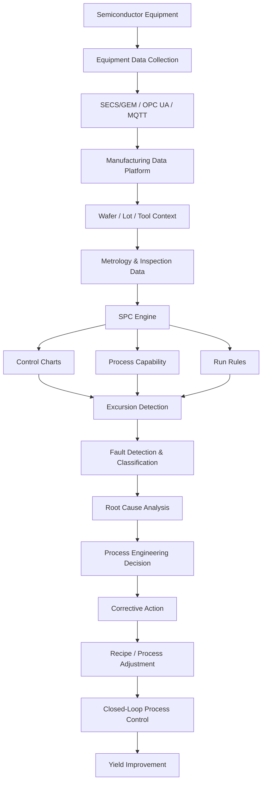
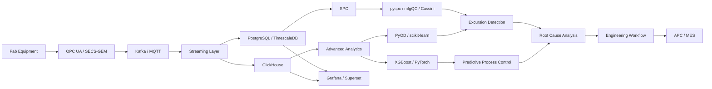
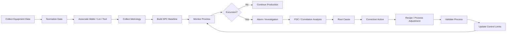

# Awesome-Semiconductor-Process-Control

## Top Semiconductor Process Control Ecosystem

**Curated List of SaaS Products & Open-Source GitHub Projects**
*Focused on Semiconductor Statistical Process Control, Yield Management, Process Monitoring, Metrology Analytics, Fault Detection, Advanced Process Control & Manufacturing Quality*
**Last updated: September 2026**

This repository tracks notable **SaaS/hosted platforms** and **open-source projects** for **Semiconductor Process Control**. These tools monitor and analyze semiconductor manufacturing processes using wafer-level measurements, metrology, inspection, equipment data, SPC charts, process capability analysis, fault detection, yield data, and advanced analytics.

Typical capabilities include **statistical process control (SPC), control charts, process capability, excursion detection, fault detection and classification (FDC), metrology integration, wafer genealogy, recipe monitoring, equipment data collection, advanced process control (APC), yield analysis, root-cause analysis, multivariate analysis, anomaly detection and closed-loop process optimization**.

**Examples** include KLA SPC, Onto Innovation Discover, Applied Materials SmartFactory, PDF Solutions Exensio, CamLine LineWorks, Siemens Opcenter Quality, InfinityQS, DataLyzer, Qualis SPC and Q-DAS (the category leaders).

**Open-source emphasis**: This section is heavily expanded with open-source SPC engines, manufacturing-quality libraries, statistical-analysis frameworks, semiconductor process-analysis projects, time-series platforms, scientific computing tools, databases, visualization systems, workflow engines and manufacturing-integration infrastructure. The open-source ecosystem does not yet provide a complete one-for-one replacement for the deeply integrated commercial semiconductor process-control suites, but it provides strong building blocks for developing self-hosted SPC, FDC, yield-analysis and process-monitoring systems.

Contributions welcome! Open a PR to add/update entries. Keep descriptions factual and link to official sites or GitHub repositories.

## Table of Contents

* [SaaS/Hosted Platforms](#saashosted-platforms)
* [Open-Source GitHub Projects](#open-source-github-projects)
* [Additional Strong Open-Source Options](#additional-strong-open-source-options)
* [Frameworks for Building Custom Semiconductor Process Control Systems](#frameworks-for-building-custom-semiconductor-process-control-systems)
* [How to Contribute](#how-to-contribute)
* [Disclaimer](#disclaimer)

## SaaS/Hosted Platforms

| Platform / Product | Description | Pricing (Starting Tier) | Free Tier / Free Trial Limit |
| :--- | :--- | :--- | :--- |
| **[KLA](https://www.kla.com/)** | Leading semiconductor process-control company providing inspection, metrology, analytics, process-control and yield-management technologies for semiconductor manufacturing. | Starts at ~$50,000/year (enterprise baseline entry tier) | 30-day proof-of-concept evaluation pilot (limited to 1 module or 1 line qualification) |
| **[KLA SPC](https://www.kla.com/)** | Semiconductor statistical process-control capabilities supporting monitoring of process measurements, control limits, excursions, trends and manufacturing quality. | Starts at ~$25,000/year (starting analytics software tier) | 28-day (4-week) fixed-scope evaluation sprint (limited to 1 tool group / pilot dataset) |
| **[Onto Innovation](https://ontoinnovation.com/)** | Semiconductor process-control company providing inspection, metrology, process-control and software solutions for wafer and advanced-packaging manufacturing. | Starts at ~$40,000/year (entry software suite package) | 30-day guided evaluation / software proof-of-concept demo environment |
| **[Onto Innovation Discover](https://ontoinnovation.com/)** | Process-control and data-analysis environment supporting semiconductor manufacturing measurements, inspection, metrology and process optimization. | Starts at ~$20,000/year (baseline yield analytics tier) | 30-day evaluation trial (limited to offline dataset analysis and pilot tool matching) |
| **[Applied Materials SmartFactory](https://www.appliedmaterials.com/)** | Digital manufacturing ecosystem connecting semiconductor equipment, factory data, analytics, automation and process-control workflows to improve fab productivity and yield. | Starts at ~$60,000/year (entry fab deployment starter tier) | 30-day sandbox pilot evaluation (limited to single-bay simulator dataset) |
| **[PDF Solutions Exensio](https://www.pdf.com/)** | Manufacturing analytics platform for semiconductor and electronics manufacturing that integrates yield, test, metrology, equipment and process data for root-cause analysis, quality and yield improvement. | Starts at ~$25,000/year (or ~$2,000/month baseline cloud tier) | Free Forever plan (Offline Analytics Sandbox with limited features) / 30-day evaluation trial (full SaaS cloud workspace) |
| **[CamLine LineWorks](https://www.camline.com/)** | Manufacturing quality and process-control software suite with LineWorks SPACE providing enterprise SPC, control charts, statistical analysis and centralized manufacturing quality management. | Starts at ~$15,000/year (or ~$1,250/month entry server license) | 30-day evaluation trial (up to 5 concurrent user seats, limited sample fab database) |
| **[Siemens Opcenter Quality](https://www.siemens.com/)** | Quality-management and statistical process-control platform supporting shop-floor inspections, process monitoring, deviation management, quality analysis and corrective actions. | Starts at ~$1,200/user/year (or ~$100/user/month starting tier) | 30-day free trial (full preconfigured cloud environment, single-user limit) |
| **[Siemens Opcenter Execution Semiconductor](https://www.siemens.com/)** | Semiconductor-focused MES platform connecting manufacturing execution, equipment integration, quality, traceability, process control, analytics and yield-related workflows. | Starts at ~$10,000/month (or ~$120,000/year entry fab site deployment) | 30-day trial environment via Siemens Xcelerator Academy / Opcenter X sandbox |
| **[InfinityQS ProFicient](https://www.infinityqs.com/)** | Enterprise manufacturing quality platform providing real-time SPC, data collection, process monitoring, quality analytics and centralized statistical quality management. | Starts at ~$75/user/month (or ~$900/user/year baseline cloud tier) | 14-day free trial (up to 3 admin user logins, 100 SPC chart streams limit) |
| **[DataLyzer](https://www.datalyzer.com/)** | Manufacturing quality and SPC software providing statistical process control, measurement data collection, capability analysis, quality reporting and process monitoring. | Starts at ~$1,495 one-time license fee (or ~$125/user/month) | 30-day free trial (full module features, up to 5 local workstation licenses) |
| **[Qualis SPC](https://www.qualis-spc.com/)** | Statistical process-control platform supporting data acquisition, control charts, process capability, alarms, quality analysis and manufacturing process monitoring. | Starts at ~$1,295 one-time license fee (or ~$105/user/month) | 30-day free trial (up to 3 production station monitors, full SPC charting tools) |
| **[Q-DAS](https://www.q-das.com/)** | Manufacturing quality and statistical-analysis software ecosystem providing SPC, measurement-data management, process capability analysis, statistical evaluation and quality reporting. | Starts at ~$2,500/user license (plus ~18% annual maintenance fee) | 90-day (3-month) trial license (available upon sales request, full analytical capabilities) |
| **[Honeywell Manufacturing Intelligence](https://www.honeywell.com/)** | Industrial manufacturing software and analytics ecosystem supporting process monitoring, production data, quality management, automation and manufacturing intelligence. | Starts at ~$15,000/year (entry Forge industrial cloud platform tier) | 30-day guided cloud evaluation (limited to 5 connected sensor streams / 1 plant area) |
| **[Rockwell Automation FactoryTalk](https://www.rockwellautomation.com/)** | Industrial software ecosystem providing manufacturing analytics, production monitoring, quality and process data integration. | Starts at ~$3,000/year (or ~$250/month starter subscription; ~$5,000/year for Developer Toolkit) | 30-day free trial license (90-day free trial for FactoryTalk Remote Access & Optix Cloud Studio) |
| **[AVEVA Manufacturing](https://www.aveva.com/)** | Industrial software platform providing MES, manufacturing intelligence, process analytics, visualization and production-quality capabilities. | Starts at ~$5,000/year (Flex subscription credit entry package) | 30-day free trial (InTouch HMI & cloud analytics trial with built-in 2-hour runtime demo mode) |
| **[AspenTech](https://www.aspentech.com/)** | Industrial software provider offering process optimization, manufacturing analytics, asset performance and advanced process-control technologies. | Starts at ~$20,000/year (token-based enterprise entry pool) | Free Online Interactive Trial (guided web-browser sandbox sessions, 14-day token test drive) |
| **[Emerson](https://www.emerson.com/)** | Industrial automation and process-control ecosystem providing manufacturing data infrastructure, advanced control, analytics and operational intelligence. | Starts at ~$6,000/year (DeltaV Flex subscription tier starting at 50 Device Signal Tags) | 30-day evaluation trial environment (via Emerson certified partner sandbox, limited to 50 DSTs) |

## Open-Source GitHub Projects

### Dedicated Open-Source SPC Platforms

* **[Cassini](https://github.com/saturnis-io/cassini)**
  Open-source manufacturing SPC platform providing real-time control charts, process capability analysis, gage R&R, first-article inspection and manufacturing-quality workflows.

* **[pyspc](https://github.com/carlosqsilva/pyspc)**
  Open-source Python SPC library supporting X-bar/R, X-bar/S, Individuals/Moving Range, EWMA, CUSUM, P, NP, C and U charts, plus multivariate control charts.

* **[mfgQC](https://github.com/cjbrant/mfgQC)**
  Open-source Python manufacturing-quality toolkit covering process capability, control charts, run-rule analysis and gage R&R.

* **[SPC Kit](https://github.com/jchester/spc-kit)**
  Open-source statistical process-control toolkit implemented using SQL/PostgreSQL, including control-chart calculations and rule detection.

* **[SPC](https://github.com/whbrewer/spc)**
  Open-source statistical process-control project providing a web-oriented foundation for SPC analysis.

* **[PyShewhart](https://github.com/huft-jonathan/pyshewhart)**
  Open-source Python module for generating Shewhart statistical process-control charts.

* **[Process Improvement](https://github.com/jimlehner/process-improvement)**
  Open-source Python package for process-variation analysis, quality calculations and statistical process-improvement workflows.

* **[Statistical Process Control for Quality Monitoring](https://github.com/Andrei-Sumin/Statistical-Process-Control-for-Quality-Monitoring)**
  Open-source research project applying image analysis, PCA and SPC techniques to manufacturing quality monitoring.

### Semiconductor Manufacturing Analytics

* **[Battery Manufacturing Statistics](https://github.com/KrishnamurthyBusam/battery-manufacturing-statistics)**
  Open-source manufacturing-statistics project covering SPC, process capability, measurement-system analysis, gauge R&R, DOE and FMEA, with applications extending to semiconductor manufacturing data.

* **[Semiconductor Manufacturing Datasets and Projects](https://github.com/topics/semiconductor-manufacturing)**
  GitHub ecosystem containing open datasets, manufacturing analytics, process-monitoring, yield-analysis and machine-learning projects relevant to semiconductor fabs.

* **[Statistical Process Control Projects](https://github.com/topics/statistical-process-control)**
  Large collection of open-source SPC projects covering control charts, quality monitoring, process capability, anomaly detection and manufacturing analytics.

### Statistical and Scientific Computing

* **[SciPy](https://github.com/scipy/scipy)**
  Core open-source scientific-computing library providing statistical distributions, hypothesis testing, optimization and numerical methods for manufacturing analytics.

* **[statsmodels](https://github.com/statsmodels/statsmodels)**
  Open-source statistical modeling library supporting regression, time-series analysis, statistical testing and process-analysis workflows.

* **[scikit-learn](https://github.com/scikit-learn/scikit-learn)**
  Open-source machine-learning library suitable for anomaly detection, classification, clustering, regression and predictive process-control applications.

* **[NumPy](https://github.com/numpy/numpy)**
  Fundamental open-source numerical-computing library for manufacturing and semiconductor data analysis.

* **[pandas](https://github.com/pandas-dev/pandas)**
  Open-source data-analysis library widely useful for processing wafer, lot, equipment, metrology and SPC datasets.

* **[R](https://github.com/r-devel/r-svn)**
  Open-source statistical-computing environment with extensive capabilities for quality engineering, process analysis and statistical modeling.

* **[R Quality Control Packages](https://github.com/topics/statistical-process-control?l=r)**
  Open-source R ecosystem covering control charts, process capability, Six Sigma and quality-control analysis.

### Multivariate and Advanced Process Monitoring

* **[PyOD](https://github.com/yzhao062/pyod)**
  Open-source Python toolkit for anomaly detection, useful for identifying abnormal process behavior and equipment conditions.

* **[River](https://github.com/online-ml/river)**
  Open-source machine-learning library for online and streaming data, useful for real-time process monitoring and adaptive anomaly detection.

* **[Merlion](https://github.com/salesforce/Merlion)**
  Open-source time-series intelligence library supporting anomaly detection, forecasting and change-point analysis.

* **[Kats](https://github.com/facebookresearch/Kats)**
  Open-source time-series analysis toolkit with forecasting, anomaly detection and change-point capabilities.

* **[PyODDS](https://github.com/datamllab/pyodds)**
  Open-source anomaly-detection framework useful for experimental industrial monitoring and time-series anomaly detection.

* **[tsfresh](https://github.com/blue-yonder/tsfresh)**
  Open-source library for automated time-series feature extraction, useful for extracting process signatures from equipment and sensor data.

* **[sktime](https://github.com/sktime/sktime)**
  Open-source time-series machine-learning framework useful for forecasting, classification and temporal process analysis.

### Industrial Time-Series and Sensor Data

* **[InfluxDB](https://github.com/influxdata/influxdb)**
  Open-source time-series database suitable for high-frequency semiconductor equipment, sensor, metrology and process-control data.

* **[TimescaleDB](https://github.com/timescale/timescaledb)**
  Open-source PostgreSQL extension optimized for time-series data, suitable for process measurements, equipment telemetry and SPC data.

* **[OpenTSDB](https://github.com/OpenTSDB/opentsdb)**
  Open-source time-series database designed for high-volume metric collection and analysis.

* **[VictoriaMetrics](https://github.com/VictoriaMetrics/VictoriaMetrics)**
  Open-source time-series database suitable for large-scale manufacturing telemetry and monitoring workloads.

* **[Prometheus](https://github.com/prometheus/prometheus)**
  Open-source monitoring and time-series platform useful for equipment-health and infrastructure monitoring around process-control systems.

### Manufacturing Data and Integration

* **[Apache Kafka](https://github.com/apache/kafka)**
  Open-source event-streaming platform suitable for high-volume wafer, equipment, metrology, test and process-control data pipelines.

* **[Apache NiFi](https://github.com/apache/nifi)**
  Open-source data-flow platform useful for collecting and routing manufacturing data from equipment, databases and factory systems.

* **[Apache Spark](https://github.com/apache/spark)**
  Open-source distributed analytics engine suitable for large-scale semiconductor manufacturing, yield and process datasets.

* **[Apache Flink](https://github.com/apache/flink)**
  Open-source stream-processing framework suitable for real-time process monitoring and excursion detection.

* **[Airbyte](https://github.com/airbytehq/airbyte)**
  Open-source data integration platform useful for moving manufacturing data between databases, warehouses and analytics systems.

* **[Meltano](https://github.com/meltano/meltano)**
  Open-source ELT platform useful for building reproducible manufacturing-data pipelines.

* **[Node-RED](https://github.com/node-red/node-red)**
  Open-source flow-based automation platform useful for equipment integration, sensor workflows, alarms and factory-data pipelines.

### Manufacturing Protocol and Equipment Integration

* **[Eclipse Sparkplug](https://github.com/eclipse-sparkplug/sparkplug)**
  Open specification and implementation ecosystem for industrial MQTT-based data exchange, useful for connected manufacturing systems.

* **[Eclipse Milo](https://github.com/eclipse-milo/milo)**
  Open-source OPC UA implementation useful for connecting semiconductor equipment and factory automation systems.

* **[open62541](https://github.com/open62541/open62541)**
  Open-source OPC UA implementation suitable for industrial equipment connectivity and manufacturing-data acquisition.

* **[MQTT](https://github.com/eclipse-mosquitto/mosquitto)**
  Open-source messaging infrastructure useful for lightweight sensor, equipment and manufacturing telemetry.

* **[Eclipse Mosquitto](https://github.com/eclipse-mosquitto/mosquitto)**
  Open-source MQTT broker useful for collecting process and equipment data from distributed manufacturing systems.

### Manufacturing Execution and Open-Source MES Foundations

* **[Odoo Community](https://github.com/odoo/odoo)**
  Open-source ERP platform with manufacturing, quality, inventory and production capabilities that can provide an operational foundation around a custom SPC system.

* **[ERPNext](https://github.com/frappe/erpnext)**
  Open-source ERP with manufacturing, quality, inventory and production functionality suitable for integrating process-control analytics.

* **[OpenBoxes](https://github.com/openboxes/openboxes)**
  Open-source inventory and logistics platform useful where semiconductor material and component traceability needs to connect with manufacturing analytics.

* **[Apache OFBiz](https://github.com/apache/ofbiz-framework)**
  Open-source enterprise application framework providing inventory, order, manufacturing and business-process capabilities.

* **[iDempiere](https://github.com/idempiere/idempiere)**
  Open-source ERP platform supporting manufacturing, inventory, procurement and enterprise operations.

### Data Visualization and SPC Dashboards

* **[Grafana](https://github.com/grafana/grafana)**
  Open-source visualization and monitoring platform suitable for real-time SPC dashboards, equipment telemetry, alarms and fab-level process monitoring.

* **[Apache Superset](https://github.com/apache/superset)**
  Open-source business-intelligence platform suitable for yield, process capability, defect, excursion and manufacturing-quality analytics.

* **[Metabase](https://github.com/metabase/metabase)**
  Open-source analytics platform suitable for SPC reporting, process dashboards and quality-management analysis.

* **[Plotly](https://github.com/plotly/plotly.py)**
  Open-source visualization library useful for interactive control charts, process distributions, wafer maps and manufacturing analytics.

* **[Bokeh](https://github.com/bokeh/bokeh)**
  Open-source Python visualization library suitable for interactive manufacturing and statistical dashboards.

### Databases and Lakehouse Infrastructure

* **[PostgreSQL](https://github.com/postgres/postgres)**
  Open-source relational database suitable for process measurements, quality records, specifications, control limits and manufacturing genealogy.

* **[ClickHouse](https://github.com/ClickHouse/ClickHouse)**
  Open-source analytical database well suited to very large manufacturing datasets and high-speed process analytics.

* **[DuckDB](https://github.com/duckdb/duckdb)**
  Open-source analytical database useful for local and engineering analysis of large SPC and metrology datasets.

* **[Apache Iceberg](https://github.com/apache/iceberg)**
  Open table format suitable for building historical manufacturing-data lakes containing large volumes of process, equipment and metrology data.

* **[Delta Lake](https://github.com/delta-io/delta)**
  Open-source storage layer useful for reliable manufacturing-data pipelines and historical analytics.

### Workflow and Automation

* **[Apache Airflow](https://github.com/apache/airflow)**
  Open-source workflow orchestration platform suitable for scheduled SPC calculations, quality reports, model retraining and manufacturing-data pipelines.

* **[Dagster](https://github.com/dagster-io/dagster)**
  Open-source data-orchestration platform useful for reproducible process-control and yield-analysis pipelines.

* **[Prefect](https://github.com/PrefectHQ/prefect)**
  Open-source workflow platform suitable for statistical analysis pipelines and manufacturing analytics.

* **[n8n](https://github.com/n8n-io/n8n)**
  Open-source workflow automation platform useful for notifications, escalation workflows, quality alerts and integration between manufacturing applications.

### AI and Machine Learning

* **[PyTorch](https://github.com/pytorch/pytorch)**
  Open-source machine-learning framework useful for predictive process modeling, defect classification and semiconductor image analysis.

* **[TensorFlow](https://github.com/tensorflow/tensorflow)**
  Open-source machine-learning framework useful for defect detection, predictive analytics and process optimization.

* **[XGBoost](https://github.com/dmlc/xgboost)**
  Open-source gradient-boosting framework useful for yield prediction, process classification and quality-risk modeling.

* **[LightGBM](https://github.com/microsoft/LightGBM)**
  Open-source gradient-boosting framework useful for large-scale manufacturing prediction and classification.

* **[MLflow](https://github.com/mlflow/mlflow)**
  Open-source machine-learning lifecycle platform useful for managing predictive process-control models and experiments.

## Additional Strong Open-Source Options

* **Dedicated SPC**: Cassini, pyspc, mfgQC, SPC Kit, PyShewhart and the broader GitHub SPC ecosystem.
* **Process capability**: mfgQC, pyspc, SciPy, statsmodels and R.
* **Anomaly detection**: PyOD, River, Merlion, Kats and scikit-learn.
* **Time-series analytics**: InfluxDB, TimescaleDB, OpenTSDB, VictoriaMetrics, pandas, tsfresh and sktime.
* **Manufacturing streaming**: Apache Kafka, Apache Flink, Apache NiFi and Node-RED.
* **Equipment connectivity**: open62541, Eclipse Milo, Eclipse Mosquitto and Eclipse Sparkplug.
* **MES foundations**: ERPNext, Odoo Community, Apache OFBiz and iDempiere.
* **Analytics dashboards**: Grafana, Apache Superset, Metabase, Plotly and Bokeh.
* **Large-scale data**: ClickHouse, PostgreSQL, DuckDB, Apache Iceberg and Delta Lake.
* **Machine learning**: PyTorch, TensorFlow, XGBoost, LightGBM, scikit-learn and MLflow.
* **Semiconductor-specific research**: open-source projects covering wafer defect classification, process monitoring, yield prediction, virtual metrology, fault detection, equipment data analysis and semiconductor manufacturing statistics.
* **Quality engineering**: Six Sigma, DOE, MSA, FMEA, capability analysis and statistical hypothesis-testing libraries can be integrated into a custom process-control platform.

**Frameworks for building custom systems**: Combine **open62541/Eclipse Milo** for equipment connectivity, **Kafka or MQTT** for event transport, **PostgreSQL/TimescaleDB/ClickHouse** for manufacturing data, **pyspc/mfgQC/Cassini** for SPC, **PyOD/scikit-learn** for anomaly detection, **Grafana/Superset** for visualization and **Airflow/Dagster** for orchestration.

## Frameworks for Building Custom Semiconductor Process Control Systems

A practical open-source semiconductor process-control architecture can combine:

**Equipment Connectivity** → open62541 / Eclipse Milo / MQTT
**Event Streaming** → Apache Kafka / Apache Flink
**Data Acquisition** → Node-RED / Apache NiFi
**Operational Database** → PostgreSQL / TimescaleDB
**Analytics Database** → ClickHouse / DuckDB
**SPC Engine** → Cassini / pyspc / mfgQC
**Anomaly Detection** → PyOD / River / scikit-learn
**Time-Series Analysis** → pandas / tsfresh / sktime
**Machine Learning** → PyTorch / XGBoost / LightGBM
**Workflow Orchestration** → Airflow / Dagster / Prefect
**Visualization** → Grafana / Superset / Metabase
**MES Integration** → ERPNext / Odoo Community
**Model Management** → MLflow

A strong general-purpose self-hosted SPC stack could be:

**open62541 + Kafka + PostgreSQL/TimescaleDB + mfgQC + Grafana + Airflow**

For advanced semiconductor process monitoring:

**Equipment Data → Kafka → ClickHouse → SPC + PyOD + XGBoost → Grafana/Superset**

For a lightweight engineering SPC environment:

**Python + pandas + SciPy + statsmodels + pyspc + Plotly**

For fab-wide quality analytics:

**OPC UA → Kafka → Data Lake → Spark/Flink → SPC/FDC/ML → Superset/Grafana**

## Semiconductor Process-Control Workflow

## Open-Source Semiconductor Process-Control Architecture

## Semiconductor Process-Control Data Model

A typical Semiconductor Process Control platform may include:

* Fab
* Factory
* Area
* Bay
* Tool
* Equipment
* Equipment Module
* Chamber
* Recipe
* Recipe Version
* Process Step
* Process Operation
* Wafer
* Wafer Lot
* Carrier
* Substrate
* Product
* Device
* Process Route
* Measurement
* Measurement Type
* Metrology Result
* Inspection Result
* Sensor Reading
* Equipment Parameter
* Process Parameter
* Specification
* Control Limit
* Target
* Upper Specification Limit
* Lower Specification Limit
* Upper Control Limit
* Lower Control Limit
* Control Chart
* SPC Rule
* SPC Violation
* Excursion
* Fault
* FDC Event
* Alarm
* Defect
* Defect Classification
* Defect Map
* Wafer Map
* Yield
* Process Capability
* Cp
* Cpk
* Pp
* Ppk
* Mean
* Standard Deviation
* Measurement System
* Gauge
* MSA
* Gauge R&R
* Operator
* Tool State
* Maintenance Event
* Engineering Change
* Recipe Change
* Corrective Action
* Root Cause
* Experiment
* DOE
* Model
* Model Version
* Simulation
* Audit Record

## Common Semiconductor Process-Control Features

A complete Semiconductor Process Control platform may support:

* Real-time SPC
* X-bar/R charts
* X-bar/S charts
* Individuals/moving-range charts
* EWMA
* CUSUM
* P/NP/C/U charts
* Multivariate SPC
* Control-limit calculation
* Specification-limit management
* Process capability
* Cp/Cpk
* Pp/Ppk
* Run-rule detection
* Outlier detection
* Excursion management
* Fault detection
* Fault classification
* Equipment monitoring
* Chamber monitoring
* Recipe monitoring
* Metrology integration
* Inspection integration
* Wafer-map analysis
* Defect analysis
* Yield analysis
* Virtual metrology
* Predictive analytics
* Root-cause analysis
* Correlation analysis
* DOE
* MSA
* Gauge R&R
* FMEA
* Process qualification
* Recipe qualification
* Equipment qualification
* Change-point detection
* Anomaly detection
* Time-series modeling
* Machine learning
* Process optimization
* APC integration
* MES integration
* SECS/GEM integration
* OPC UA integration
* Data lineage
* Audit trails
* Alerting
* Escalation workflows
* Multi-fab analytics
* Historical trend analysis
* Real-time dashboards

## Semiconductor Process-Control Lifecycle

## AI-Assisted Semiconductor Process Control

Potential AI-assisted capabilities include:

* Virtual metrology
* Wafer-quality prediction
* Yield prediction
* Defect classification
* Wafer-map classification
* Equipment anomaly detection
* Chamber-health prediction
* Recipe-drift detection
* Process-drift prediction
* Root-cause ranking
* Correlation discovery
* Sensor-feature extraction
* Predictive maintenance
* Excursion prediction
* Process-window optimization
* Recipe optimization
* Automated engineering summaries
* Natural-language SPC investigation
* Cross-tool comparison
* Cross-product correlation
* Automated alarm prioritization

A recommended architecture is:

**Equipment + Metrology Data → SPC/FDC → Machine Learning → Engineering Review → Process Adjustment → Validation**

AI-generated process recommendations should remain subject to qualified process-engineer review, especially when changes can affect wafer quality, yield, equipment safety or production stability.

## Semiconductor Process-Control KPIs

Useful Semiconductor Process Control metrics include:

* Process capability
* Cp
* Cpk
* Pp
* Ppk
* Mean shift
* Sigma level
* Control-limit violations
* Specification violations
* Excursion frequency
* Excursion duration
* False-alarm rate
* Detection latency
* Mean time to detect
* Mean time to resolve
* Defect density
* Defect rate
* Wafer yield
* Die yield
* Final-test yield
* First-pass yield
* Process-window width
* Equipment-to-equipment variation
* Chamber-to-chamber variation
* Tool matching
* Recipe stability
* Metrology repeatability
* Gauge R&R
* Measurement uncertainty
* Equipment availability
* Process drift
* Scrap rate
* Rework rate
* Yield loss
* Root-cause resolution time
* Model accuracy
* Virtual-metrology error
* FDC precision
* FDC recall
* APC response time

## How to Contribute

1. Fork the repo.
2. Add/edit entries in `README.md` following the existing format.
3. Include: name, link, a 1–2 sentence description and whether it is SaaS/hosted or open-source.
4. Clearly indicate whether an open-source project is a complete SPC platform, statistical library, manufacturing-data platform, equipment-integration framework or supporting component.
5. Prefer actively maintained projects with clear licenses, documentation and reproducible statistical methods.
6. Submit a PR with a short explanation.

Star the repo if you find it useful!

## Disclaimer

* This is a **community-curated** list — not exhaustive and not an endorsement.
* Semiconductor process control is highly specialized, and commercial platforms often contain proprietary integrations, semiconductor-specific algorithms, equipment interfaces, manufacturing models and domain-specific workflows that are not replicated by general-purpose open-source tools.
* Statistical-process-control calculations and control limits should be validated by qualified quality and process engineers before being used for production decisions.
* Open-source statistical libraries generally provide analytical building blocks rather than certified semiconductor-fab process-control systems.
* Equipment integration may require specialized SECS/GEM, GEM300, EDA/Interface A, OPC UA or vendor-specific interfaces.
* Production fabs require appropriate cybersecurity, access control, auditability, data integrity, high availability, disaster recovery and change-management controls.
* AI-generated recommendations should be validated before modifying production recipes or process parameters.

---

**Made for semiconductor fabs, process engineers, yield engineers, quality engineers, equipment engineers, manufacturing-data teams, researchers, developers and Industry 4.0 organizations.**

Let's make semiconductor process control more **open, interoperable, transparent, reproducible and data-driven**.
